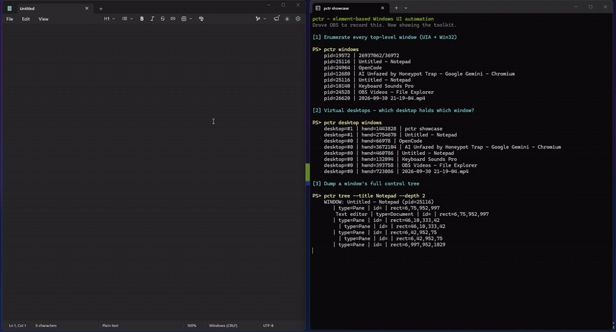

# pctr

Element-based Windows UI Automation CLI for AI agents.

Instead of screenshotting and guessing pixel coordinates, `pctr` finds controls
by their **name / control type / automation id** and acts on them. Window moves,
DPI changes, and layout shifts don't break your script.

Built on `pywinauto` (UI Automation) with `pyautogui` / `pydirectinput` for raw
mouse and keyboard input. On top of UIA it also offers **OCR**
(`Windows.Media.Ocr`) and **YOLO-World** open-vocabulary detection for text and
objects that aren't exposed as controls.



*UIA finds/clicks/sets controls by name; OCR reads the screen back. (Recorded with OBS, driven by pctr itself.)*

## Install

```bash
pip install pctr
pip install "pctr[vision]"   # adds ultralytics for `pctr look`
```

Windows only.

## MCP server

`pctr` ships a Model Context Protocol server so MCP clients (Claude Desktop,
Cursor, opencode, ...) can drive the Windows desktop directly:

```bash
pip install "pctr[mcp]"
```

Add it to your client config (stdio):

```json
{ "mcpServers": { "pctr": { "command": "pctr-mcp" } } }
```

(or `"command": "python", "args": ["-m", "pctr.mcp_server"]`)

Tools exposed: `pctr_windows`, `pctr_tree`, `pctr_find`, `pctr_click`,
`pctr_set`, `pctr_type`, `pctr_keys`, `pctr_hotkey`, `pctr_focus`, `pctr_wait`,
`pctr_shot`, `pctr_ocr`, `pctr_ocrfind`, `pctr_ocrclick`, `pctr_look`,
`pctr_desktop`.

## Commands

| Command | What it does |
|---------|--------------|
| `pctr windows [--filter RE] [--process PID]` | List top-level windows (`pid=… \| title`). |
| `pctr tree --title RE [--depth N] [--limit N]` | Dump the UIA control tree of a window. |
| `pctr find --title RE [--name RE] [--limit N] [--nth N]` | List matching elements. |
| `pctr click --title RE --name RE [--method auto\|invoke\|mouse] [--dbl]` | Click an element. |
| `pctr set --title RE --name RE --text S` | Set a field via the UIA ValuePattern (exact, instant). |
| `pctr type [--title RE --name RE] --text S [--delay 0.03] [--chunk 1]` | Send keystrokes (see notes). |
| `pctr keys --keys "{ENTER}"` | Send a global key combo (pywinauto syntax). |
| `pctr hotkey --keys ctrl+s` | Send a modifier combo (prefer this over `keys "^s"`). |
| `pctr focus --title RE` | Bring a window to the foreground. |
| `pctr wait --title RE --name RE [--timeout S]` | Wait until an element exists. |
| `pctr shot [--title RE] --out PATH` | Screenshot the screen or a window. |
| `pctr size` | Print primary screen size as `WxH`. |
| `pctr desktop <action>` | Virtual desktops: `list` / `windows` / `where` / `on-current` / `next` / `prev` / `new` / `close` / `move-window`. |
| `pctr move --x N --y N` / `down` / `up` / `hold --ms N` | Raw mouse control (`--direct` for games). |
| `pctr drag --start x,y --end x,y [--duration S]` | Drag between two points. |
| `pctr keydown / keyup --key a` / `keyhold --key w --ms 1500` | Hold keyboard keys (`--direct` for games). |
| `pctr ocr [--title RE]` | OCR the screen/window; list words with boxes. |
| `pctr ocrfind --text RE` | OCR then list matches with click centers (single words). |
| `pctr ocrclick --text RE [--nth N]` | OCR then click a word. |
| `pctr look --for "a dog" [--title RE] [--conf X]` | YOLO-World detect objects by text prompt. |
| `pctr lookclick --for "a dog" [--nth N]` | Detect then click the top match. |
| `pctr skill [--install]` / `pctr setup` | Print/install the agent skill + an AGENTS.md section. |

Common filters: `--title` (regex), `--name` (regex), `--control-type`
(`Button`, `Edit`, `Pane`, `MenuItem`, …), `--auto-id`, `--nth`, `--process`.

`click`, `set`, `wait` accept **any** selector - `--name` is not required.
`tree`/`find` require a window selector (`--title` or `--process`).

## The loop

```bash
pctr tree  --title "Notepad" --limit 60      # see what's clickable
pctr click --title "Notepad" --name "^File$"
pctr set   --title "Notepad" --name "Text Editor" --text "hello"
```

## Virtual desktops

```bash
pctr desktop list                       # desktops (#index, guid, [current], window count)
pctr desktop windows --desktop 1        # windows on desktop #1
pctr desktop where --title "App"        # which desktop a window is on
pctr desktop on-current --title "App"   # True / False
pctr desktop next | prev | new | close  # switch (moves the active desktop)
pctr desktop move-window --title RE --to N
```

- Switching uses the standard Win+Ctrl hotkeys and moves the **active** desktop
  (you included). Add `--direct` if a game has focus.
- **Cross-desktop control:** UIA actions (`click --method invoke`, `set`) reach
  windows on another desktop **without switching** (accessibility layer, not
  screen input). Raw mouse/keys only affect the active desktop.
- **`move-window` is blocked on Windows 11** (third-party `MoveWindowToDesktop`
  returns `Access denied`); it works on Windows 10.

## Exit codes

- `0` success, `1` no match / window not found, `2` usage/validation error.
- Errors print one `error: …` line - no tracebacks.

## Notes

- Prefer `set` (ValuePattern) over `type` for text fields - it can't drop or
  reorder characters. `type`'s element path uses pywinauto `type_keys`, which
  interprets `{ } + ^ % ~ ( )` as key syntax, so it is **not** literal.
- Global `type` / `keys` go to the OS-focused window - `pctr focus` first.
- Prefer `pctr hotkey --keys ctrl+s` over `keys "^s"`; the `^` modifier is
  fragile through shells.
- `ocrfind`/`ocrclick` match one **word** at a time (Windows OCR tokenizes words).
- `look` reads its model from `--model` or the `PCTR_YOLO_MODEL` env var; progress
  bars go to stderr so stdout stays parseable.
- Qt apps expose a rich tree including embedded webviews. Electron apps expose
  only the window frame (use `focus` + global keys, or drive them over CDP).
- Games ignore synthetic input - pass `--direct` to mouse/key commands and focus
  the game first.

## License

MIT
